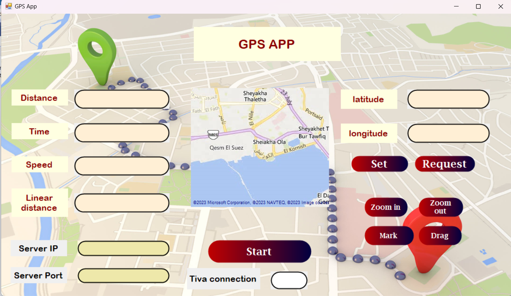

# GPS-Application Tracker 
## Description:
The GPS Application Tracker GUI is a user-friendly graphical interface built using C# for tracking GPS data. This application allows users to monitor and visualize GPS coordinates in real-time, providing a seamless experience for tracking and mapping purposes.

## Features:

- Real-time GPS Tracking: The application provides real-time updates of GPS coordinates, allowing users to track movements accurately.
- User-friendly Interface: The GUI is designed with simplicity in mind, making it easy for users to navigate and operate the application.
- Map Visualization: GPS coordinates are displayed on a map within the application, providing a visual representation of the tracked location.
- Customizable Settings: Users can customize various settings such as map type, zoom level, and update frequency according to their preferences.
- Save and Export Data: The application allows users to save and export GPS data for further analysis or sharing purposes.

related to this project : https://github.com/zainmo11/GPS-Tracker-Tiva.git

